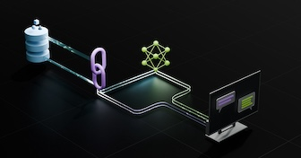

# Projet iono_seismic_IA  - NVIDIA and LlamaIndex Developer Contest 



# Objectives
This RAG application aims to extract relevant information from scientific data to help understand the interactions between the ionosphere, atmosphere and the lithosphere.   

"Investigations into multiple anomalous phenomena in the lithosphere–atmosphere–ionosphere (LAI) coupling before major earthquakes are considered an important aspect of predicting earthquake occurrences.While earthquake prediction remains a significant challenge, integrating various geophysical parameters can help us understand the evolution of pre-earthquake anomalous phenomena and uncover the causal mechanisms involved."[https://doi.org/10.3390/geosciences13120356]   

This integration of diverse data sources is crucial for advancing our understanding of the complex interactions within the Earth system. By leveraging artificial intelligence techniques, it processes vast amounts of multidisciplinary data, including seismic records, atmospheric measurements, and ionospheric observations.   

Recent studies have emerged stipulating that there is a relationship between the lithosphere, the atmosphere, and the ionosphere.[LithosphereAtmosphereIonosphere_Coupling](https://mdpi-res.com/bookfiles/book/9758/LithosphereAtmosphereIonosphere_Coupling_during_Earthquake_Preparation_Recent_Advances_and_Future_Perspectives.pdf?v=1731031549)

```
On the Impact of Geospace Weather on the Occurrence of M7.8/M7.5 Earthquakes on 6 February 2023 (Turkey), 
Possibly Associated with the Geomagnetic Storm of 7 November 2022
Dimitar Ouzounov 1, * and Galina Khachikyan

Abstract: A joint analysis of solar wind, geomagnetic field, and earthquake catalog data showed that
before the catastrophic M = 7.8 and M = 7.5 Kahramanmaras earthquake sequence on 6 February
2023, a closed strong magnetic storm occurred on 7 November 2022, SYM/H = −117 nT. The storm
started at 08:04 UT. https://doi.org/10.3390/geosciences14060159 

On 30 October 2020, a strong M = 7.0 earthquake occurred in the Aegean Sea at
11:51:27 UTC with coordinates of the epicenter 37.897◦ N, 26.784◦ E, at a depth of 21.0 km.
This earthquake was preceded by two sequential small magnetic storms (Figure 4), which
satisfied the chosen criteria: at the time of geomagnetic storm onset, the high-latitudinal area
of the longitudinal region of the earthquake epicenter was located under the polar cusp.
The first such minor geomagnetic storm started on 2 August 2020, at 09:23 UT with a
positive “SYM/H” = +27 nT and reached its most significant negative “SYM/H” = −39 nT
on 3 August at 03:31 UT (Figure 5). In the initial phases of this storm, the magnetic local
time around the future epicenter (37.897◦ N, 26.784◦ E) was equal to MLT = ~11.66 h. Thus,
at the time of this storm’s onset, the high-latitude part of the longitudinal region, where the
M = 7.0 earthquake later occurred, was located under the polar cusp. The delay between
this magnetic storm onset and earthquake occurrence equals ~89 days.[https://doi.org/10.3390/geosciences14060159]
```


## Overview: RAG AI for Advanced Data Analysis"

The core concept of RAG (Retrieval-Augmented Generation) is to consolidate diverse sources of information, including multiple documents and presentations on the subject. Moreover, it aims to compile and process vast amounts of scientific data collected from various sensors. This approach leverages AI to efficiently analyze and synthesize information that would otherwise require an impractical amount of time and resources for human researchers to process manually. By doing so, RAG enhances our ability to extract meaningful insights from complex and voluminous datasets, potentially uncovering patterns and relationships that might otherwise remain hidden
  
One of the objectives is to utilize the analytical power of Large Language Models (LLMs) to detect measurement sequences that we have not yet discovered. This will enhance our understanding of the subject.

This application is not exhaustive, as I am not a specialist in ionosphere/atmosphere/lithosphere interactions. Additionally, time constraints have limited the collection of relevant data, delaying immediate results from advanced searches for events within the data noise. The ultimate goal of this project is to leverage Large Language Models (LLMs) to identify interesting and potentially significant data sequences among the vast amount of seismic and ionospheric data available. 

However, I believe meaningful results are achievable with further development and analysis.


This project is just a POC (Proof of Concept) to correlate multiple events in a given geographical area and then to analyze scientific data more precisely. Currently, we are taking into account ionograms, earthquakes, STECs from the GPS constellation, and solar data. But later, we could incorporate data for jet streams, pressures, temperatures, and more.

## Features, the same as the GenerativeAIExamples

- **Multi-format Document Processing**: Handles text files, PDFs, PowerPoint presentations, and images.
- **Advanced Text Extraction**: Extracts text from PDFs and PowerPoint slides, including tables and embedded images.
- **Image Analysis**: Uses a VLM (NeVA) to describe images and Google's DePlot for processing graphs/charts on NIM microservices.
- **Vector Store Indexing**: Creates a searchable index of processed documents using Milvus vector store. This folder is auto generated on execution.
- **Split Document into 512 tokens**: Limit set with "bert-base-uncased"; an overlap is applied to avoid data loss.
- **Interactive Chat Interface**: Allows users to query the processed information through a chat-like interface.
- **Automatically send prompt to the model at startup**: At each request, the model receives prompt instructions in order to generate the best response.
- **Interactive Map Interface**: Allows the LLM to change the map position in response to a user query requesting to display a map position (not 100% tested)."

## Setup

**The python version musst be >= 3.10** 

1. Clone the repository:
```
git clone https://github.com/rag-agentic/iono_seismic_AI.git
cd iono_seismic_AI
```

2. (Optional) Create a conda environment or a virtual environment:

   - Using conda:
     ```
     conda create --name iono_seismic_AI python=3.10
     conda activate iono_seismic_AI
     ```

   - Using venv:
     ```
     python -m venv .venv --prompt iono_seismic_AI
     source .venv/bin/activate
     ```

3. Install the required packages:

    ```
    pip install -r requirements.txt
    ```

4. Set up your NVIDIA API key as an environment variable:
    ```
    export NVIDIA_API_KEY="your-api-key-here"
    ```

5. Refer this [tutorial](https://milvus.io/docs/install_standalone-docker-compose-gpu.md) to install and start the GPU-accelerated Milvus container:

    ```
    sudo docker compose up -d
    ```

## Usage

1. Ensure the Milvus container is running:

  ```bash
  docker ps
  ```

2. Run the Streamlit app:
    ```
    cs src
    streamlit run app_rag.py
    ```

3. Open the provided URL in your web browser.

4. Choose between uploading files or specifying a directory path containing your documents.


5. Process the files by clicking the "Process Files" or "Process Directory" button.


6. Once processing is complete, use the chat interface to query your documents.


## Todo list
    - Improve interaction with the map via an agent-based system (event search, positioning on the map)
    - Display all earthquakes in real time and solar storm (TEC value)
    - Locate a zone and auto-zoom when an event is detected and predicted by the LLM based on ionosphere and earthquake data
    - Increase the number of documents 
    - Change the 'nividia/mistral-7b-instruct-v0.2' model to one with greater parameters.

## End

_Without the help of generative AI, this project wouldn't have been finished in time_


 

